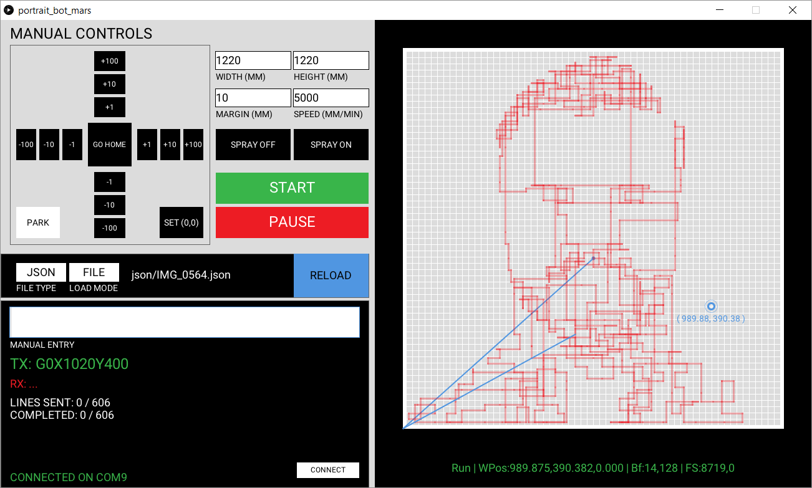
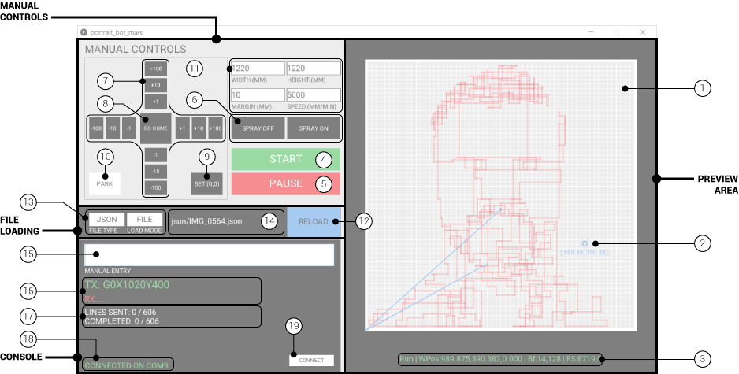

# Portrait-bot Controller Software
_Designed & built by The Living, an Autodesk Studio. 2017._

1. #### [User Interface](#user-interface)
2. #### [Typical Workflow](#typical-workflow)
3. #### [Manual GCODE Commands](#manual-gcode-commands)

***
The application can either be run from [Processing](https://processing.org/download/) using the `portrait_bot_mars.pde` sketch or by using a precompiled standalone executable file located in `portrait_bot_mars\application.windows` (32bit or 64bit).

***
# [User Interface](#user-interface)

  ### PREVIEW Area
- __(1) Canvas Preview Window__ Blue: spray off / Red: spray on
- __(2) Current Position__ Displays nozzle's current (x, y) position, in mm.
- __(3) Machine Status__ Displays current machine status, including state, work position (_WPos_), buffer capacity (_Bf_), and feedrate / servo position (_FS_).

### MANUAL CONTROL Area

- __(4) Start/Reset__ (While not running) Starts streaming commands to the robot. (While paused) Resets the machine, clearing all queued commands and moving back to the home position.
- __(5) Pause/Resume__ (While running) Pauses the machine, and releases the servo. (While paused) Re-engages the servo, and resumes the drawing process.
- __(6) Spray Control__ Manually start/stop airbrush sprayer.
- __(7) Machine Jogging__ Move nozzle up/down/left/right in 1, 10, or 100mm increments
- __(8) Go Home__ Moves nozzle back to home (0,0) position
- __(9) Set Origin__ Sets current nozzle position as the work origin (0,0).
- __(10) Park__ Return machine to starting position (machine origin) - useful when shutting down to prevent machine movement after de-powering.
- __(11) Canvas Settings__ Current settings for canvas (width, height, uniform margin) and max painting speed (in mm/min). Hit `ENTER` after entering a new value to update settings.

### FILE LOADING Area
- __(12) Load File__ Opens a dialogue to select file(s) to run
- __(13) Load Settings__ Toggle input file type (GCODE txt / JSON) and loading mode (SINGLE FILE / DIRECTORY).
- __(14) Current File__ Displays currently loaded file or directory.

### CONSOLE Area
- __(15) Manual Command Entry__ Allows GCODE commands to be entered and issued manually. Hit ENTER to submit command. Robot will execute manual commands immediately.
- __(16) TX/RX Commands__ Displays last transmitted command (TX) and last received message (RX).
- __(17) Drawing Status__ Displays GCODE lines issued to serial buffer, and GCODE lines processed by the robot.
- __(18) Connection Status__ Will indicate connection to robot controller over serial COM port.
- __(19) Connect/Reconnect__ Attempts to (re)connect to robot controller over COM port. A drop-down list will appear if multiple ports are available.

---
# [Typical Workflow](#typical-workflow)
1. If not connected, plug in USB connection to Arduino controller and press `CONNECT` to establish serial connection.
2. Update canvas width, height, margin, and painting speed settings. After hitting `ENTER`, you will see the canvas preview update.
3. Use the `JOGGING` buttons to position the sprayer at the bottom left corner of the canvas. Click `SET ORIGIN` to set this as your work coordinate origin (0,0).
4. Select correct load settings (file type and loading mode), then click `LOAD` to select and process drawing file(s). A preview will appear in the Canvas Preview area.
5. Click `START` to begin machine operation. Click `PAUSE` to temporarily halt the machine operation, and `RESUME`. Click `RESET` if you need to cancel the drawing and return to home position.
6. Repeat from (4) to load a new drawing.

---
# [Manual GCODE Commands](#manual-gcode-commands)

See [GRBL 1.1 Wiki](https://github.com/gnea/grbl/wiki/Grbl-v1.1-Commands) for more information about interfacing with robot controller.

`G0 / G1` __MOVE Command__
- G0: Move at max speed
- G1: Move at specified feed rate (F)
- X: Destination X coordinate (in mm)
- Y: Destination Y coordinate (in mm)
- F: Feed rate (in mm/min)
- Example: `G1X55.5Y125.25F2500.0` or `G0X1220.0Y1220.0`

`G2 / G3` __ARC Command__
- G2: Move in a clockwise arc (with blasting)
- G3: Move in a counter-clockwise arc (with blasting)
- I: Arc center X coordinate, given relative to current position (in mm)
- J: Arc center Y coordinate, given relative to current position (in mm)
- X: Destination X coordinate, absolute position (in mm)
- Y: Destination Y coordinate, absolute position (in mm)
- F: Feed rate (in mm/min)
- Example: `G02I10.0J0.0X20.0Y0.0F5000.0`

`G4 / G5` __DWELL Command__
- G4: Pause (without blasting)
- G5: Dwell (with blasting)
- P: Duration (in seconds)
- Example: `G4P0.25`

`M3 / M5` __SERVO Control__
- M5: Move servo to zero position
- M3: Move servo to specified position (S)
- S: Servo position, ranging from 0-1000
- _Our servo model (SG90) has a 180&deg range of motion_
- Example: `M3S200` or `M5`
